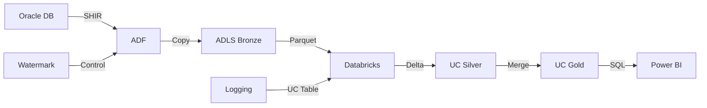

# Architecture Diagram

## End-to-End Data Pipeline

```mermaid
graph LR
    A[Oracle DB] -->|SHIR| B[ADF]
    B -->|Copy| C[ADLS Bronze]
    C -->|Parquet| D[Databricks]
    D -->|Delta| E[UC Silver]
    E -->|Merge| F[UC Gold]
    F -->|SQL| G[Power BI]
    H[Watermark] -->|Control| B
    I[Logging] -->|UC Table| D
```

